<h2>⚡ Infinity Gauntlet</h2>
<p align="center">
  
</p>

<pre>
⭐ Full-stack productivity app built with the MERN stack (MongoDB, Express, React, Node.js)
   A clean, secure task manager with JWT auth, Google sign-in, multilingual UI, and personal todos.
</pre>

 &nbsp;
 &nbsp;
 &nbsp;
 &nbsp;
 &nbsp;
 &nbsp;
 &nbsp;


<br/>

<h3>🎯 About</h3>
Infinity Gauntlet is a full-stack productivity application that helps you manage tasks with a Kanban-style interface (Pending → Doing → Done). Each user has their own private, secure workspace with JWT authentication. The app supports multiple languages (English, Spanish, Portuguese) and includes dark/light theme switching.

**Current Features:**
<pre>
✅ Email/password registration and login
✅ Google OAuth sign-in via Google Identity Services
✅ JWT-based authentication for API requests
✅ Todo management with description, edit, delete, and complete actions
✅ Per-user task isolation
✅ Stored todo statuses: pending / doing / done
✅ Multilingual UI (English, Spanish, Portuguese)
✅ Responsive frontend for desktop and mobile
✅ Dark/light theme toggle with OS preference support
✅ Secure password hashing with bcryptjs
✅ Express + MongoDB REST API
🔜 Telegram bot notifications
🔜 Google Calendar sync
🔜 Password recovery via email
🔜 Task reminders
</pre>

<h3>🛠️ Tech Stack</h3>

**Frontend**
<pre>
- React 19
- React Router DOM 7
- Create React App with react-scripts
- Sass/SCSS styling
- Context API for language management
- Google Identity Services for OAuth sign-in
- React Icons for UI icons
</pre>

**Backend**
<pre>
- Node.js + Express 5
- MongoDB Atlas / Mongoose
- JWT Authentication
- bcryptjs password hashing
- CORS and Morgan
- google-auth-library for Google token verification
- Nodemon for development
</pre>

<h3>📋 Prerequisites</h3>

- Node.js >= 18
- Yarn or npm
- MongoDB Atlas account (free tier available) or MongoDB connection string
- Git

<h3>🚀 Getting Started</h3>

**1. Clone the project**

```bash
git clone https://github.com/A2calanche/infinity-gauntlet-project-main.git
cd infinity-gauntlet-project-main
```

**2. Install dependencies**

```bash
# Root dependencies
cd /workspaces/infinity-gauntlet-project-main
yarn install

# Frontend
cd frontend
yarn install

# Backend
cd ../backend
yarn install
```

**3. Configure environment variables**

#### Backend (`backend/.env`)
```bash
MONGO_URI=your-mongodb-connection-string
PORT=3001
JWT_SECRET=your-super-secret-random-string
GOOGLE_CLIENT_ID=your-google-client-id
GOOGLE_CLIENT_SECRET=your-google-client-secret
```

#### Frontend (`frontend/.env`)
```bash
REACT_APP_API_URL=http://localhost:3001
REACT_APP_GOOGLE_CLIENT_ID=your-google-client-id
```
#### **Google OAuth Configuration Steps**

1. **Create a Google Cloud Project:**
   - Go to [Google Cloud Console](https://console.cloud.google.com/)
   - Create a new project

2. **Enable Google+ API:**
   - Search for "Google+ API" in the search bar
   - Click "Enable"

3. **Create OAuth 2.0 Credentials:**
   - Go to "APIs & Services" → "Credentials"
   - Click "Create Credentials" → "OAuth 2.0 Client IDs"
   - Choose "Web application"
   - Add Authorized JavaScript origins:
     ```
     http://localhost:3000
     http://localhost:3001
     https://your-production-domain.com
     ```
   - Add Authorized redirect URIs:
     ```
     http://localhost:3001/auth/google/callback
     https://your-production-domain.com/auth/google/callback
     ```
   - Copy the **Client ID** and **Client Secret**

4. **Add credentials to your .env files:**
   - Paste `Client ID` in both `backend/.env` (as `GOOGLE_CLIENT_ID`) and `frontend/.env` (as `REACT_APP_GOOGLE_CLIENT_ID`)
   - Paste `Client Secret` in `backend/.env` (as `GOOGLE_CLIENT_SECRET`)
> The app supports email/password auth without Google OAuth. Google sign-in is optional but available in the login and registration pages.

**4. Run the project**

**Option A: Start both from root**
```bash
yarn start
```

**Option B: Run separately**
```bash
# Backend
cd backend
yarn start

# Frontend
cd frontend
yarn start
```

The frontend runs at `http://localhost:3000` and the backend API runs at `http://localhost:3001`.

```mermaid
flowchart TB
    classDef folder stroke:#818cf8,fill:#eef2ff,stroke-width:2px
    classDef file stroke:#38bdf8,fill:#f0f9ff

    FRONTEND["frontend/"]:::folder --> PUBLIC["public/"]:::folder
    FRONTEND --> SRC["src/"]:::folder

    SRC --> APP["App.js"]:::file
    SRC --> APP_SCSS["App.scss"]:::file
    SRC --> COMPONENTS["components/"]:::folder
    SRC --> CONTEXT["context/"]:::folder
    SRC --> HOOKS["hooks/"]:::folder
    SRC --> LOCALES["locales/"]:::folder
    SRC --> SERVICES["services/"]:::folder

    COMPONENTS --> LANDING["Landing.js"]:::file
    COMPONENTS --> LOGIN["LogIn.js"]:::file
    COMPONENTS --> SIGNIN["SignIn.js"]:::file
    COMPONENTS --> TODO["Todo.js"]:::file
    COMPONENTS --> TODOFORM["TodoForm.js"]:::file
    COMPONENTS --> TODOLIST["TodoList.js"]:::file

    CONTEXT --> LANGCTX["LanguageContext.js"]:::file

    HOOKS --> GBTN["useGoogleSignInButton.js"]:::file

    LOCALES --> EN["en.json"]:::file
    LOCALES --> ES["es.json"]:::file
    LOCALES --> PT["pt.json"]:::file

    SERVICES --> CONN["conection.js"]:::file
    BACKEND["backend/"]:::folder --> BSRC["src/"]:::folder

    BSRC --> INDEX["index.js"]:::file
    BSRC --> DBF["db/"]:::folder
    BSRC --> MIDDLE["middlewares/"]:::folder
    BSRC --> MODELS["models/"]:::folder
    BSRC --> ROUTERS["routers/"]:::folder

    DBF --> DBINDEX["index.js"]:::file

    MIDDLE --> AUTH["auth.js"]:::file
    MIDDLE --> GOOGLE["googleOAuth.js"]:::file
    MIDDLE --> VALIDATOR["validator.js"]:::file

    MODELS --> TODO_M["Todo.js"]:::file
    MODELS --> USERS_M["Users.js"]:::file

    ROUTERS --> AUTH_R["auth-routers.js"]:::file
    ROUTERS --> TODOS_R["to-dos.routers.js"]:::file
```

<h3>📁 Project Structure</h3>



<h3>🌍 Multilingual Support</h3>

The UI supports three languages:
- **English** (EN) 🇺🇸
- **Spanish** (ES) 🇲🇽
- **Portuguese** (PT) 🇧🇷

Language selection is available in the top-right selector and is saved to `localStorage`.

<h3>🎨 Themes</h3>

The app includes two themes:
- **Dark Theme** — default based on OS preference
- **Light Theme** — toggleable by the user

Theme selection is available via the sun/moon button in the top-right.

<h3>🔐 Authentication</h3>

**Registration Flow:**
1. User submits name, email, and password
2. Password is hashed with bcryptjs before saving
3. JWT token is created and returned
4. Token is stored in `localStorage`

**Login Flow:**
1. User submits email and password
2. Backend verifies password with bcryptjs
3. JWT token is created and returned
4. Token is used for authenticated requests

**Google Login Flow:**
1. User clicks the Google sign-in button
2. Frontend sends the credential token to `/v1/auth/google`
3. Backend verifies the Google token and creates or reuses the user
4. Backend returns a JWT token for API requests

**JWT Token:**
- Payload: `{ id, email }`
- Expiration: 7 days
- Sent in `Authorization: Bearer {token}` header

<h3>📝 API Endpoints</h3>

**Authentication**
```bash
POST   /v1/auth/register      # Create new user
POST   /v1/auth/login         # Email/password login
POST   /v1/auth/google        # Google OAuth login
```

**Todos (requires JWT)**
```bash
GET    /v1/to-dos             # Get todos for current user
POST   /v1/to-dos             # Create a todo
PATCH  /v1/to-dos/:id         # Update todo
DELETE /v1/to-dos/:id         # Delete todo
```

<h3>📊 Database Schema</h3>

**User**
```javascript
{
  name: String,
  email: String,
  password: String,
  googleId: String,
  timestamps: true
}
```

**Todo**
```javascript
{
  userId: ObjectId,
  title: String,
  description: String,
  is_done: Boolean,
  status: String, // pending | doing | done
  timestamps: true
}
```

<h3>🔄 Latest Updates</h3>

**June 2026**
- Added secure JWT authentication and per-user todo storage
- Added Google OAuth sign-in with backend token verification
- Added multilingual UI support (EN/ES/PT)
- Added dark/light theme toggle with OS preference support
- Added todo descriptions, edit, delete, and complete actions
- Improved responsive UI and landing page
**Previous (2025)**
- Migrated database from SQLite → MongoDB Atlas
- Added JWT authentication
- Implemented per-user task isolation
- Added dark/light theme toggle
- Built RESTful API architecture

**Original (2023)**
- Basic CRUD to-do list
- SQLite database
- Express REST API
- React frontend

<h3>🛣️ Roadmap</h3>

- [ ] Telegram bot notifications
- [ ] Google Calendar sync
- [ ] Email password recovery
- [ ] Task reminders & notifications
- [ ] Task tags / categories
- [ ] Subtasks
- [ ] Recurring tasks
- [ ] Priority levels
- [ ] Team collaboration
- [ ] Docker containerization
- [ ] CI/CD pipeline

<h3>🤝 Contributing</h3>

Contributions are welcome! Please fork the repository, create a branch, and open a pull request.

<h3>📄 License</h3>

This project is licensed under the MIT License — see the LICENSE file for details.

<h3>👨‍💻 Author</h3>

**Arturo Alejandro Calanche Pino**
- GitHub: [@A2calanche](https://github.com/A2calanche)

---

<p align="center">
  Made with ❤️ and lots of ☕
</p>
